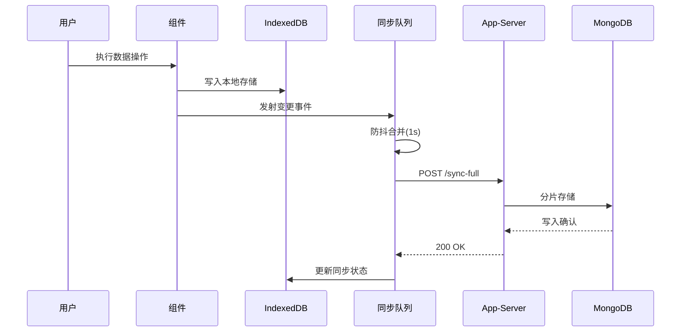

```mermaid

sequenceDiagram
    participant 用户
    participant 组件
    participant IndexedDB
    participant 同步队列
    participant App-Server
    participant MongoDB

    用户->>组件: 执行数据操作
    组件->>IndexedDB: 写入本地存储
    组件->>同步队列: 发射变更事件
    同步队列->>同步队列: 防抖合并(1s)
    同步队列->>App-Server: POST /sync-full
    App-Server->>MongoDB: 分片存储
    MongoDB-->>App-Server: 写入确认
    App-Server-->>同步队列: 200 OK
    同步队列->>IndexedDB: 更新同步状态

```