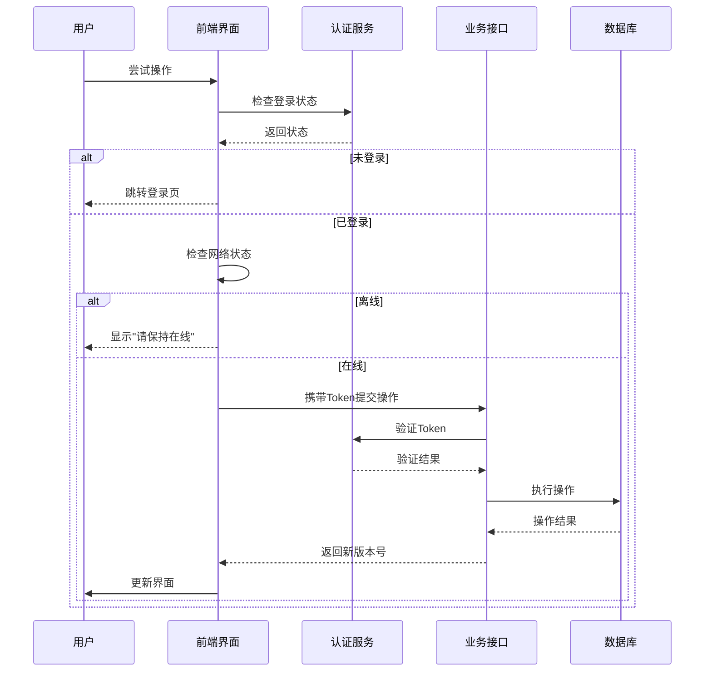

```mermaid
sequenceDiagram
    participant U as 用户
    participant UI as 前端界面
    participant Auth as 认证服务
    participant API as 业务接口
    participant DB as 数据库

    U->>UI: 尝试操作
    UI->>Auth: 检查登录状态
    Auth-->>UI: 返回状态
    
    alt 未登录
        UI-->>U: 跳转登录页
    else 已登录
        UI->>UI: 检查网络状态
        alt 离线
            UI-->>U: 显示"请保持在线"
        else 在线
            UI->>API: 携带Token提交操作
            API->>Auth: 验证Token
            Auth-->>API: 验证结果
            API->>DB: 执行操作
            DB-->>API: 操作结果
            API-->>UI: 返回新版本号
            UI->>U: 更新界面
        end
    end
```