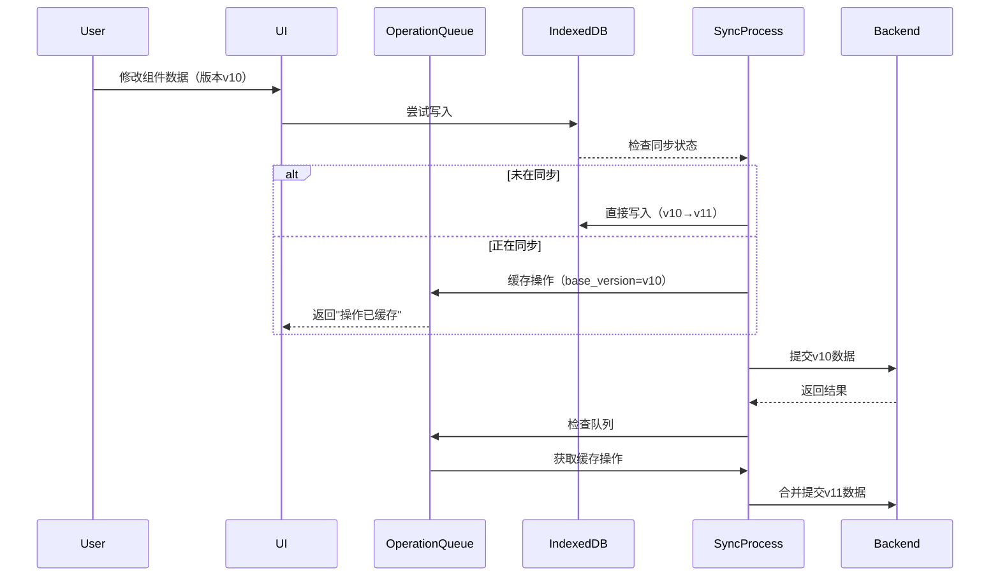

```mermaid
sequenceDiagram
    participant User
    participant UI
    participant OperationQueue
    participant IndexedDB
    participant SyncProcess
    
    User->>UI: 修改组件数据（版本v10）
    UI->>IndexedDB: 尝试写入
    IndexedDB-->>SyncProcess: 检查同步状态
    alt 未在同步
        SyncProcess->>IndexedDB: 直接写入（v10→v11）
    else 正在同步
        SyncProcess->>OperationQueue: 缓存操作（base_version=v10）
        OperationQueue-->>UI: 返回"操作已缓存"
    end
    
    SyncProcess->>Backend: 提交v10数据
    Backend-->>SyncProcess: 返回结果
    SyncProcess->>OperationQueue: 检查队列
    OperationQueue->>SyncProcess: 获取缓存操作
    SyncProcess->>Backend: 合并提交v11数据
```