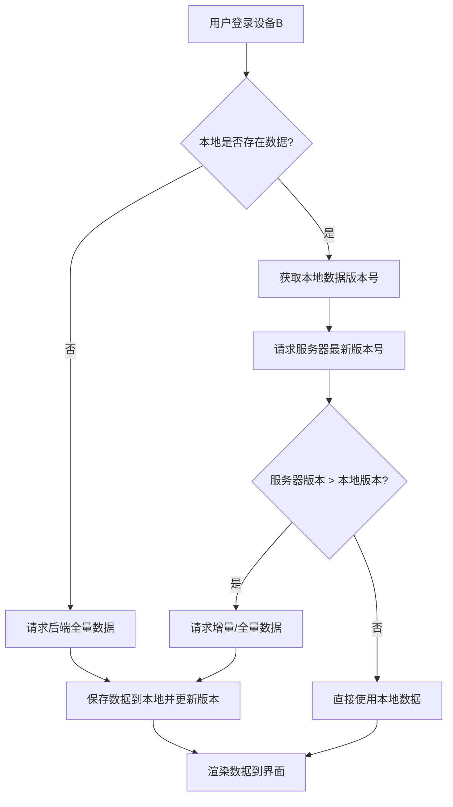

```mermaid
flowchart TD
    A[用户登录设备B] --> B{本地是否存在数据?}
    B -->|否| C[请求后端全量数据]
    B -->|是| D[获取本地数据版本号]
    D --> E[请求服务器最新版本号]
    E --> F{服务器版本 > 本地版本?}
    F -->|是| G[请求增量/全量数据]
    F -->|否| H[直接使用本地数据]
    C --> I[保存数据到本地并更新版本]
    G --> I
    I --> J[渲染数据到界面]
    H --> J
```