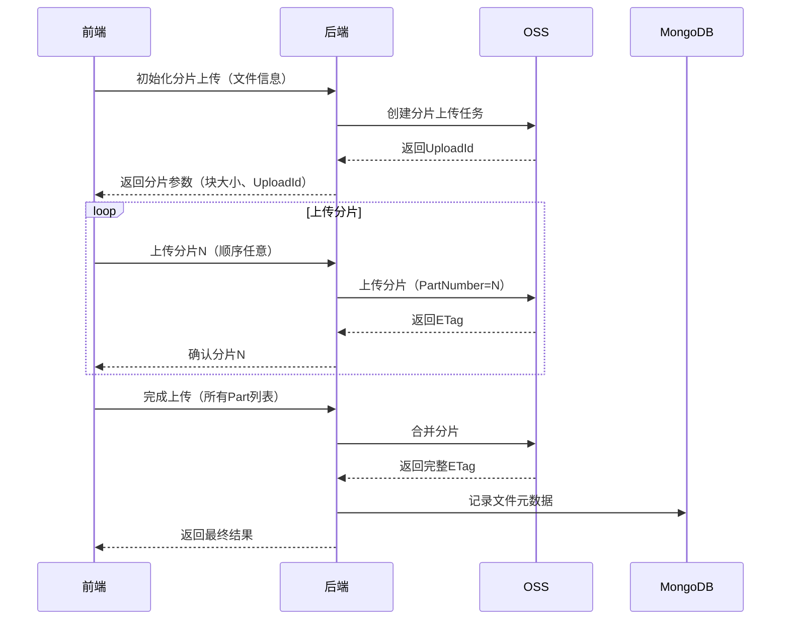

```mermaid
sequenceDiagram
    participant 前端
    participant 后端
    participant OSS

    前端->>后端: 初始化分片上传（文件信息）
    后端->>OSS: 创建分片上传任务
    OSS-->>后端: 返回UploadId
    后端-->>前端: 返回分片参数（块大小、UploadId）

    loop 上传分片
        前端->>后端: 上传分片N（顺序任意）
        后端->>OSS: 上传分片（PartNumber=N）
        OSS-->>后端: 返回ETag
        后端-->>前端: 确认分片N
    end

    前端->>后端: 完成上传（所有Part列表）
    后端->>OSS: 合并分片
    OSS-->>后端: 返回完整ETag
    后端->>MongoDB: 记录文件元数据
    后端-->>前端: 返回最终结果
```