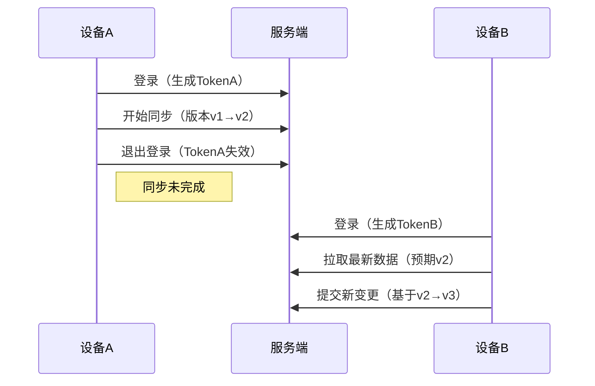

```mermaid
sequenceDiagram
    participant A as 设备A
    participant S as 服务端
    participant B as 设备B

    A->>S: 登录（生成TokenA）
    A->>S: 开始同步（版本v1→v2）
    A->>S: 退出登录（TokenA失效）
    Note right of A: 同步未完成
    B->>S: 登录（生成TokenB）
    B->>S: 拉取最新数据（预期v2）
    B->>S: 提交新变更（基于v2→v3）
```