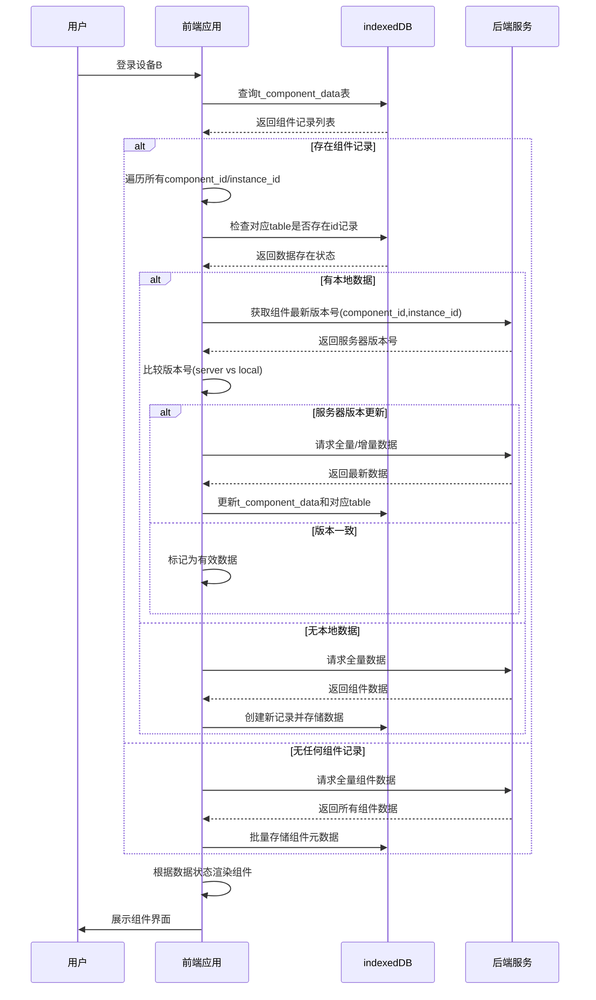

```mermaid
sequenceDiagram
    participant 用户
    participant 前端应用
    participant indexedDB
    participant 后端服务

    用户->>前端应用: 登录设备B
    前端应用->>indexedDB: 查询t_component_data表
    indexedDB-->>前端应用: 返回组件记录列表
    
    alt 存在组件记录
        前端应用->>前端应用: 遍历所有component_id/instance_id
        前端应用->>indexedDB: 检查对应table是否存在id记录
        indexedDB-->>前端应用: 返回数据存在状态
        
        alt 有本地数据
            前端应用->>后端服务: 获取组件最新版本号(component_id,instance_id)
            后端服务-->>前端应用: 返回服务器版本号
            前端应用->>前端应用: 比较版本号(server vs local)
            
            alt 服务器版本更新
                前端应用->>后端服务: 请求全量/增量数据
                后端服务-->>前端应用: 返回最新数据
                前端应用->>indexedDB: 更新t_component_data和对应table
            else 版本一致
                前端应用->>前端应用: 标记为有效数据
            end
        else 无本地数据
            前端应用->>后端服务: 请求全量数据
            后端服务-->>前端应用: 返回组件数据
            前端应用->>indexedDB: 创建新记录并存储数据
        end
    else 无任何组件记录
        前端应用->>后端服务: 请求全量组件数据
        后端服务-->>前端应用: 返回所有组件数据
        前端应用->>indexedDB: 批量存储组件元数据
    end
    
    前端应用->>前端应用: 根据数据状态渲染组件
    前端应用->>用户: 展示组件界面
```