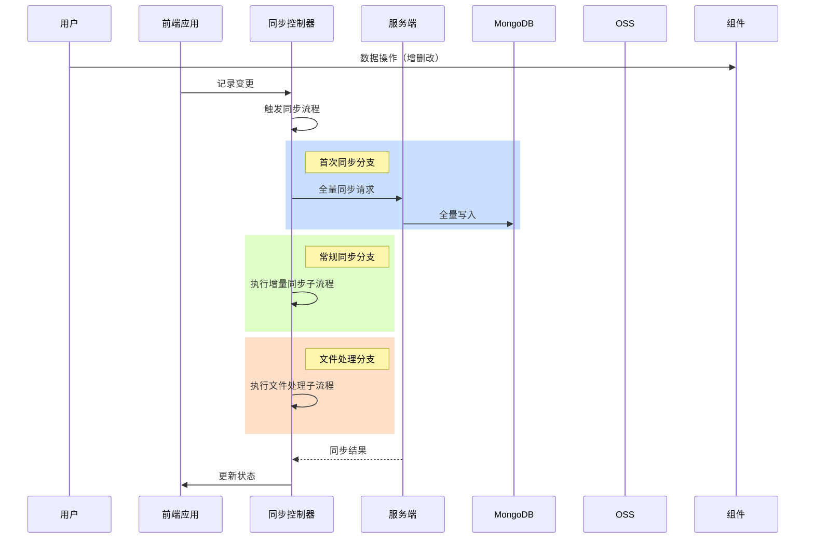

```mermaid
sequenceDiagram
    participant 用户
    participant 前端应用
    participant 同步控制器
    participant 服务端
    participant MongoDB
    participant OSS

    用户->>组件: 数据操作（增删改）
    前端应用->>同步控制器: 记录变更
    同步控制器->>同步控制器: 触发同步流程
    
    rect rgb(200,223,255)
    Note right of 同步控制器: 首次同步分支
    同步控制器->>服务端: 全量同步请求
    服务端->>MongoDB: 全量写入
    end

    rect rgb(223,255,200)
    Note right of 同步控制器: 常规同步分支
    同步控制器->>同步控制器: 执行增量同步子流程
    end

    rect rgb(255,223,200)
    Note right of 同步控制器: 文件处理分支
    同步控制器->>同步控制器: 执行文件处理子流程
    end

    服务端-->>同步控制器: 同步结果
    同步控制器->>前端应用: 更新状态
```