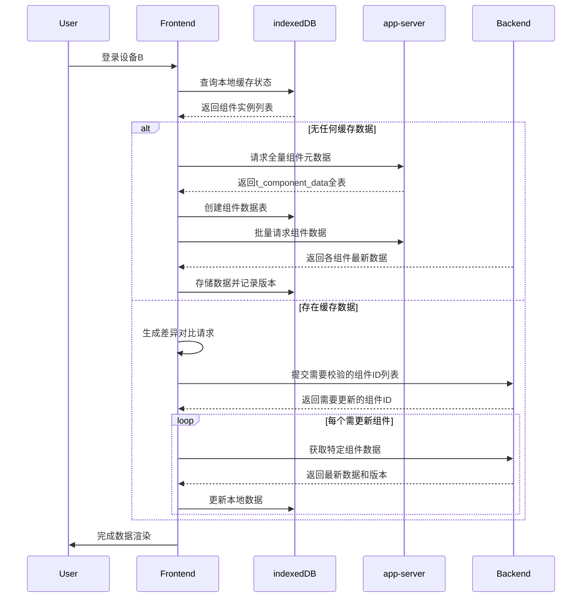

```mermaid
sequenceDiagram
    participant User
    participant Frontend
    participant indexedDB
    participant app-server

    User->>Frontend: 登录设备B
    Frontend->>indexedDB: 查询本地缓存状态
    indexedDB-->>Frontend: 返回组件实例列表
    
    alt 无任何缓存数据
        Frontend->>app-server: 请求全量组件元数据
        app-server-->>Frontend: 返回t_component_data全表
        Frontend->>indexedDB: 创建组件数据表
        Frontend->>app-server: 批量请求组件数据
        Backend-->>Frontend: 返回各组件最新数据
        Frontend->>indexedDB: 存储数据并记录版本
    else 存在缓存数据
        Frontend->>Frontend: 生成差异对比请求
        Frontend->>Backend: 提交需要校验的组件ID列表
        Backend-->>Frontend: 返回需要更新的组件ID
        loop 每个需更新组件
            Frontend->>Backend: 获取特定组件数据
            Backend-->>Frontend: 返回最新数据和版本
            Frontend->>indexedDB: 更新本地数据
        end
    end
    Frontend->>User: 完成数据渲染
```