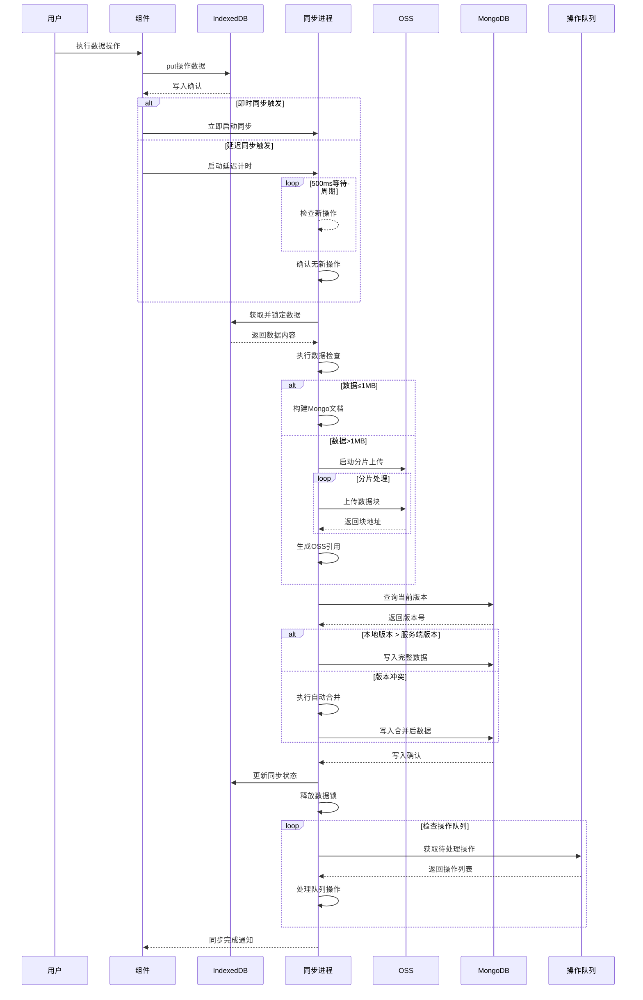

```mermaid
sequenceDiagram
    participant 用户 as 用户
    participant 组件 as 组件
    participant IDB as IndexedDB
    participant 同步器 as 同步进程
    participant OSS as OSS
    participant MongoDB as MongoDB
    participant 队列 as 操作队列

    用户->>组件: 执行数据操作
    组件->>IDB: put操作数据
    IDB-->>组件: 写入确认
    
    alt 即时同步触发
        组件->>同步器: 立即启动同步
    else 延迟同步触发
        组件->>同步器: 启动延迟计时
        loop 500ms等待周期
            同步器-->>同步器: 检查新操作
        end
        同步器->>同步器: 确认无新操作
    end
    
    同步器->>IDB: 获取并锁定数据
    IDB-->>同步器: 返回数据内容
    
    同步器->>同步器: 执行数据检查
    alt 数据≤1MB
        同步器->>同步器: 构建Mongo文档
    else 数据>1MB
        同步器->>OSS: 启动分片上传
        loop 分片处理
            同步器->>OSS: 上传数据块
            OSS-->>同步器: 返回块地址
        end
        同步器->>同步器: 生成OSS引用
    end
    
    同步器->>MongoDB: 查询当前版本
    MongoDB-->>同步器: 返回版本号
    
    alt 本地版本 > 服务端版本
        同步器->>MongoDB: 写入完整数据
    else 版本冲突
        同步器->>同步器: 执行自动合并
        同步器->>MongoDB: 写入合并后数据
    end
    
    MongoDB-->>同步器: 写入确认
    同步器->>IDB: 更新同步状态
    同步器->>同步器: 释放数据锁
    
    loop 检查操作队列
        同步器->>队列: 获取待处理操作
        队列-->>同步器: 返回操作列表
        同步器->>同步器: 处理队列操作
    end
    
    同步器-->>组件: 同步完成通知
```