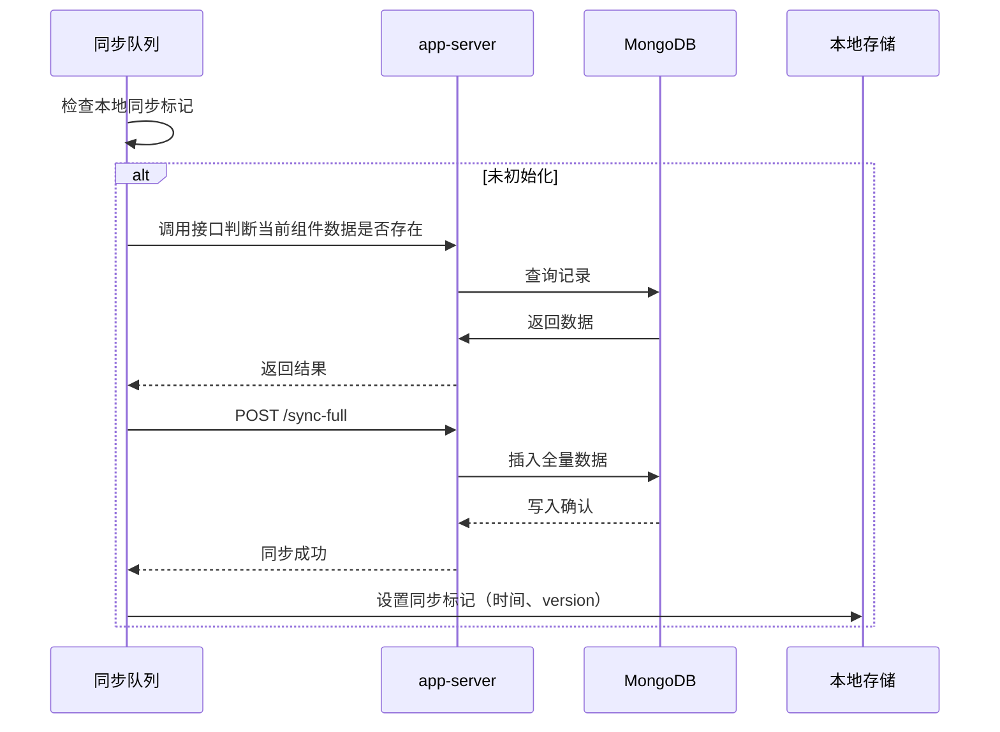

```mermaid
sequenceDiagram
    participant 同步队列
    participant app-server
    participant MongoDB

    同步队列->>同步队列: 检查本地同步标记
    alt 未初始化
        同步队列->>app-server: 调用接口判断当前组件数据是否存在
        app-server->>MongoDB: 查询记录
        MongoDB->>app-server: 返回数据
        app-server-->>同步队列: 返回结果
        同步队列->>app-server: POST /sync-full
        app-server->>MongoDB: 插入全量数据
        MongoDB-->>app-server: 写入确认
        app-server-->>同步队列: 同步成功
        同步队列->>本地存储: 设置同步标记（时间、version）
    end
```