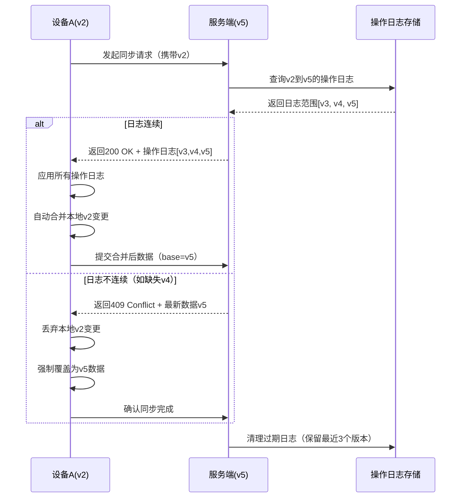

```mermaid

sequenceDiagram
    participant A as 设备A(v2)
    participant S as 服务端(v5)
    participant DB as 操作日志存储


    A->>S: 发起同步请求（携带v2）
    S->>DB: 查询v2到v5的操作日志
    DB-->>S: 返回日志范围[v3, v4, v5]
    
    alt 日志连续
        S-->>A: 返回200 OK + 操作日志[v3,v4,v5]
        A->>A: 应用所有操作日志
        A->>A: 自动合并本地v2变更
        A->>S: 提交合并后数据（base=v5）
    else 日志不连续（如缺失v4）
        S-->>A: 返回409 Conflict + 最新数据v5
        A->>A: 丢弃本地v2变更
        A->>A: 强制覆盖为v5数据
        A->>S: 确认同步完成
    end
    
    S->>DB: 清理过期日志（保留最近3个版本）

```