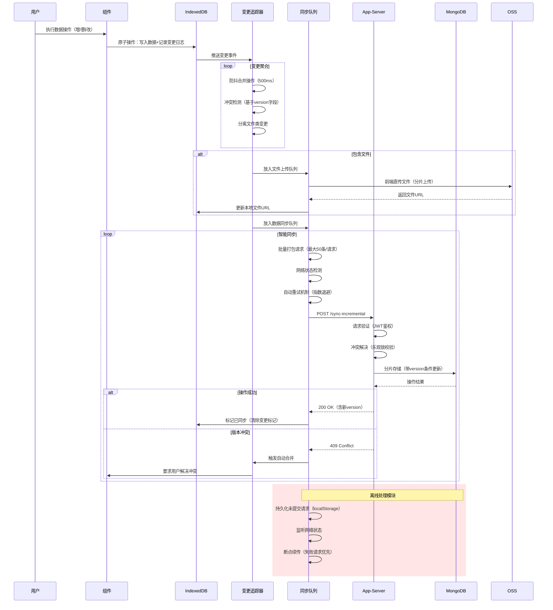

```mermaid
sequenceDiagram
    participant 用户
    participant 组件
    participant IndexedDB
    participant 变更追踪器
    participant 同步队列
    participant App-Server
    participant MongoDB
    participant OSS

    用户->>组件: 执行数据操作（增/删/改）
    组件->>IndexedDB: 原子操作：写入数据+记录变更日志
    IndexedDB->>变更追踪器: 推送变更事件
    
    loop 变更聚合
        变更追踪器->>变更追踪器: 防抖合并操作（500ms）
        变更追踪器->>变更追踪器: 冲突检测（基于version字段）
        变更追踪器->>变更追踪器: 分离文件类变更
    end

    alt 包含文件
        变更追踪器->>同步队列: 放入文件上传队列
        同步队列->>OSS: 前端直传文件（分片上传）
        OSS-->>同步队列: 返回文件URL
        同步队列->>IndexedDB: 更新本地文件URL
    end

    变更追踪器->>同步队列: 放入数据同步队列
    
    loop 智能同步
        同步队列->>同步队列: 批量打包请求（最大50条/请求）
        同步队列->>同步队列: 网络状态检测
        同步队列->>同步队列: 自动重试机制（指数退避）
        
        同步队列->>App-Server: POST /sync-incremental
        App-Server->>App-Server: 请求验证（JWT鉴权）
        App-Server->>App-Server: 冲突解决（乐观锁校验）
        App-Server->>MongoDB: 分片存储（带version条件更新）
        MongoDB-->>App-Server: 操作结果
        alt 操作成功
            App-Server-->>同步队列: 200 OK（含新version）
            同步队列->>IndexedDB: 标记已同步（清除变更标记）
        else 版本冲突
            App-Server-->>同步队列: 409 Conflict
            同步队列->>变更追踪器: 触发自动合并
            变更追踪器->>组件: 要求用户解决冲突
        end
    end

    %% 离线处理流程
    rect rgba(255,0,0,0.1)
        Note over 同步队列,MongoDB: 离线处理模块
        同步队列->>同步队列: 持久化未提交请求（localStorage）
        同步队列->>同步队列: 监听网络状态
        同步队列->>同步队列: 断点续传（失败请求优先）
    end
```