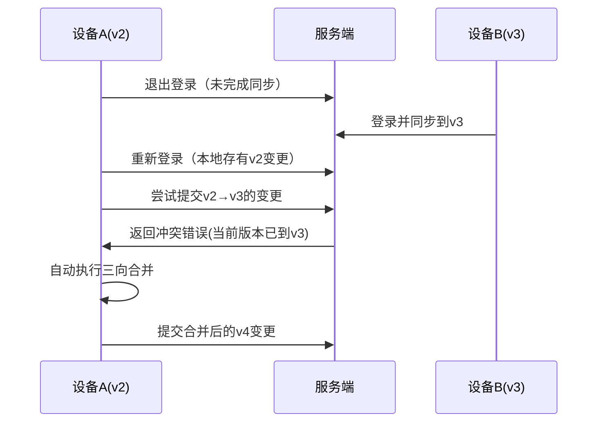

```mermaid
sequenceDiagram
    participant A as 设备A(v2)
    participant S as 服务端
    participant B as 设备B(v3)

    A->>S: 退出登录（未完成同步）
    B->>S: 登录并同步到v3
    A->>S: 重新登录（本地存有v2变更）
    A->>S: 尝试提交v2→v3的变更
    S->>A: 返回冲突错误(当前版本已到v3)
    A->>A: 自动执行三向合并
    A->>S: 提交合并后的v4变更
```