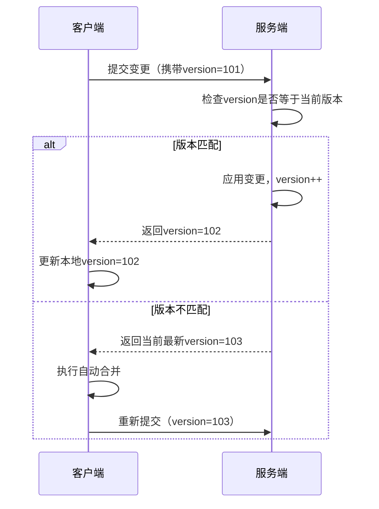

```mermaid
sequenceDiagram
    participant C as 客户端
    participant S as 服务端

    C->>S: 提交变更（携带version=101）
    S->>S: 检查version是否等于当前版本
    alt 版本匹配
        S->>S: 应用变更，version++
        S-->>C: 返回version=102
        C->>C: 更新本地version=102
    else 版本不匹配
        S-->>C: 返回当前最新version=103
        C->>C: 执行自动合并
        C->>S: 重新提交（version=103）
    end
```