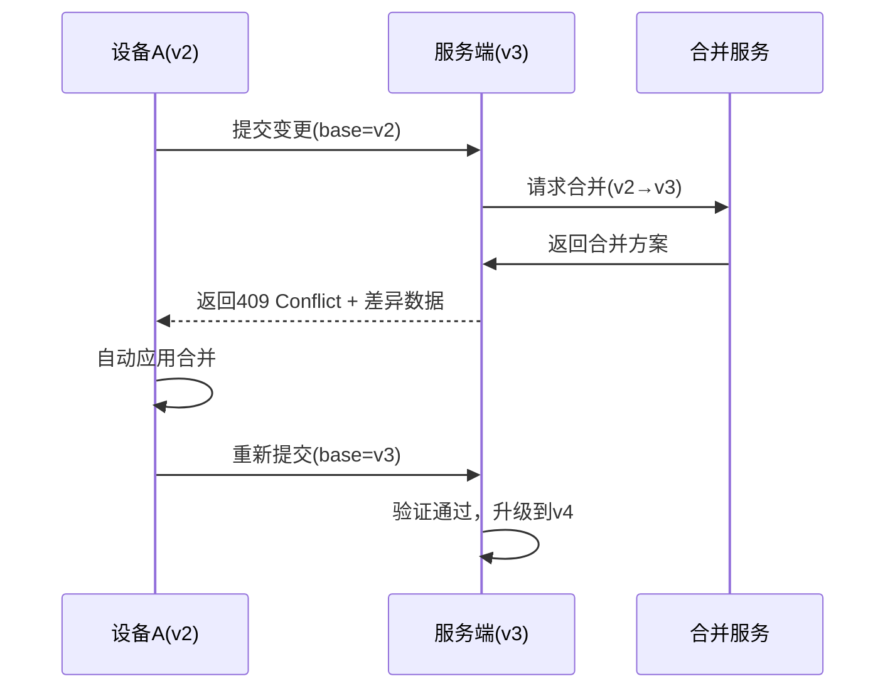

```mermaid
sequenceDiagram
    participant A as 设备A(v2)
    participant S as 服务端(v3)
    participant M as 合并服务

    A->>S: 提交变更(base=v2)
    S->>M: 请求合并(v2→v3)
    M->>S: 返回合并方案
    S-->>A: 返回409 Conflict + 差异数据
    A->>A: 自动应用合并
    A->>S: 重新提交(base=v3)
    S->>S: 验证通过，升级到v4
```