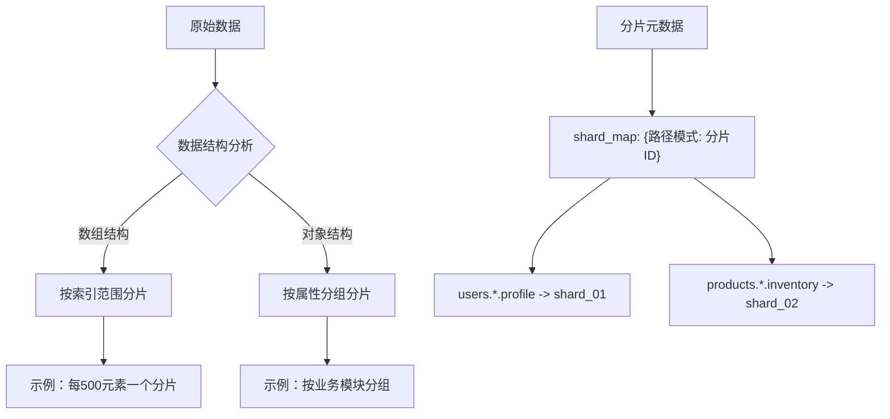

```mermaid
graph TD
    A[原始数据] --> B{数据结构分析}
    B -->|数组结构| C[按索引范围分片]
    B -->|对象结构| D[按属性分组分片]
    C --> E[示例：每500元素一个分片]
    D --> F[示例：按业务模块分组]
    
    G[分片元数据] --> H["shard_map: {路径模式: 分片ID}"]
    H --> I["users.*.profile -> shard_01"]
    H --> J["products.*.inventory -> shard_02"]
```