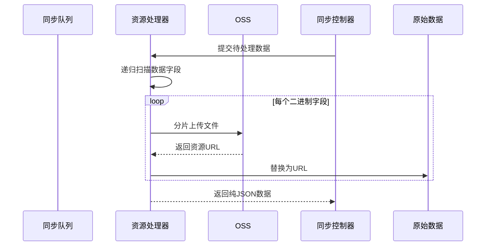

```mermaid

sequenceDiagram
    participant 同步队列
    participant 资源处理器
    participant OSS

    同步控制器->>资源处理器: 提交待处理数据
    资源处理器->>资源处理器: 递归扫描数据字段
    loop 每个二进制字段
        资源处理器->>OSS: 分片上传文件
        OSS-->>资源处理器: 返回资源URL
        资源处理器->>原始数据: 替换为URL
    end
    资源处理器-->>同步控制器: 返回纯JSON数据

```