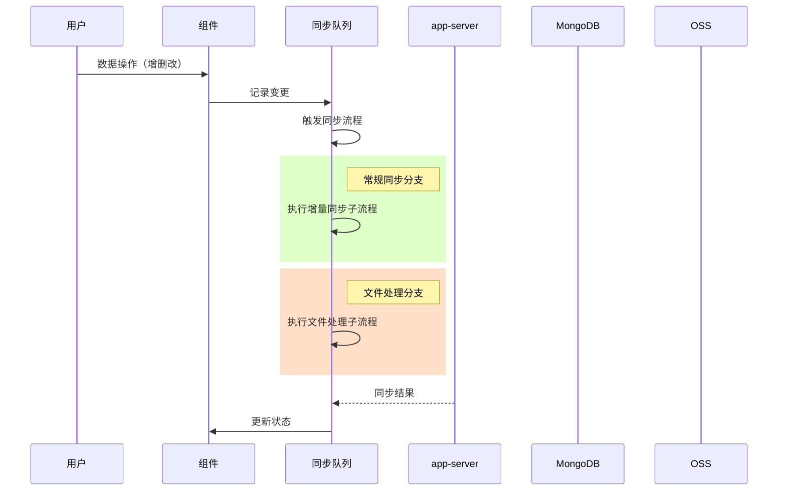

```mermaid

sequenceDiagram
    participant 用户
    participant 组件
    participant 同步队列
    participant app-server
    participant MongoDB
    participant OSS


    用户->>组件: 数据操作（增删改）
    组件->>同步队列: 记录变更
    同步队列->>同步队列: 触发同步流程


    rect rgb(223,255,200)
    Note right of 同步队列: 常规同步分支
    同步队列->>同步队列: 执行增量同步子流程
    end

    rect rgb(255,223,200)
    Note right of 同步队列: 文件处理分支
    同步队列->>同步队列: 执行文件处理子流程
    end
    
    

    app-server-->>同步队列: 同步结果
    同步队列->>组件: 更新状态

```