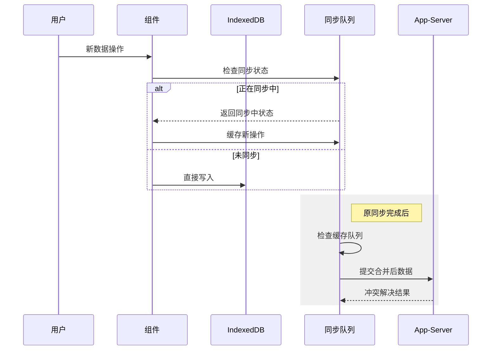

```mermaid
sequenceDiagram
    participant 用户
    participant 组件
    participant IndexedDB
    participant 同步队列
    participant App-Server

    用户->>组件: 新数据操作
    组件->>同步队列: 检查同步状态
    alt 正在同步中
        同步队列-->>组件: 返回同步中状态
        组件->>同步队列: 缓存新操作
    else 未同步
        组件->>IndexedDB: 直接写入
    end
    
    rect rgb(240,240,240)
    Note right of 同步队列: 原同步完成后
    同步队列->>同步队列: 检查缓存队列
    同步队列->>App-Server: 提交合并后数据
    App-Server-->>同步队列: 冲突解决结果
    end
```