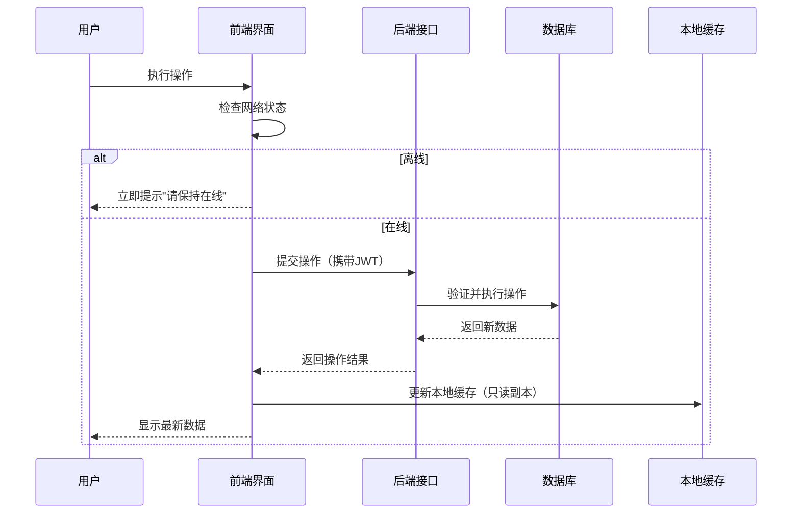

```mermaid
sequenceDiagram
    participant User as 用户
    participant UI as 前端界面
    participant API as 后端接口
    participant DB as 数据库
    participant Cache as 本地缓存

    User->>UI: 执行操作
    UI->>UI: 检查网络状态
    alt 离线
        UI-->>User: 立即提示"请保持在线"
    else 在线
        UI->>API: 提交操作（携带JWT）
        API->>DB: 验证并执行操作
        DB-->>API: 返回新数据
        API-->>UI: 返回操作结果
        UI->>Cache: 更新本地缓存（只读副本）
        UI-->>User: 显示最新数据
    end
```