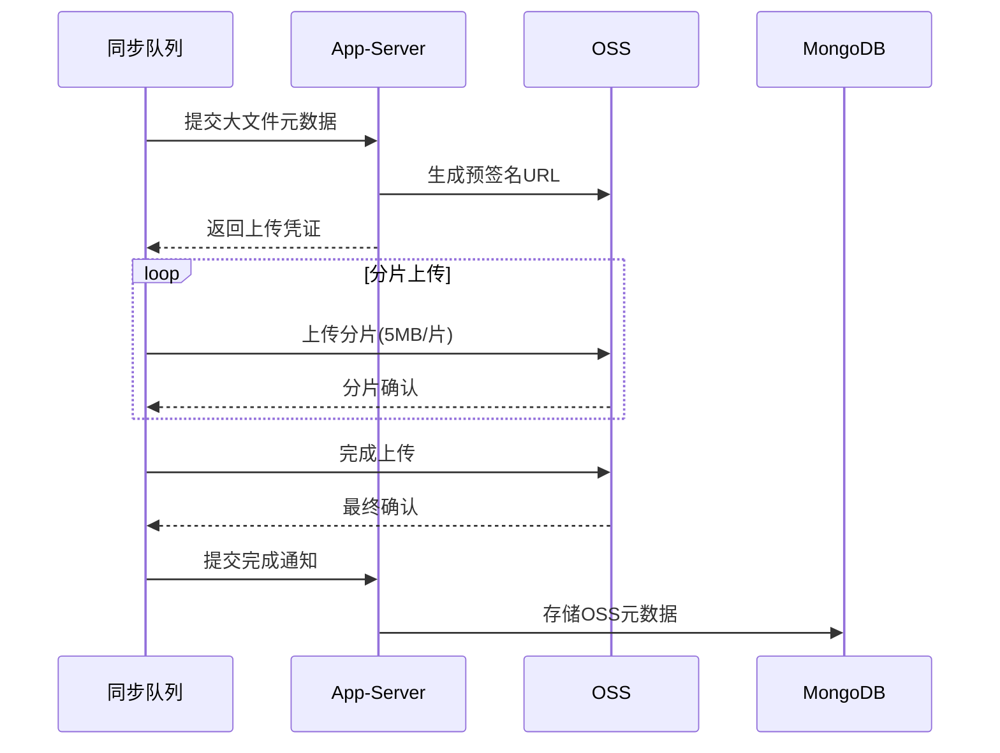

```mermaid
sequenceDiagram
    participant 同步队列
    participant App-Server
    participant OSS
    participant MongoDB

    同步队列->>App-Server: 提交大文件元数据
    App-Server->>OSS: 生成预签名URL
    App-Server-->>同步队列: 返回上传凭证
    
    loop 分片上传
        同步队列->>OSS: 上传分片(5MB/片)
        OSS-->>同步队列: 分片确认
    end
    
    同步队列->>OSS: 完成上传
    OSS-->>同步队列: 最终确认
    同步队列->>App-Server: 提交完成通知
    App-Server->>MongoDB: 存储OSS元数据
```