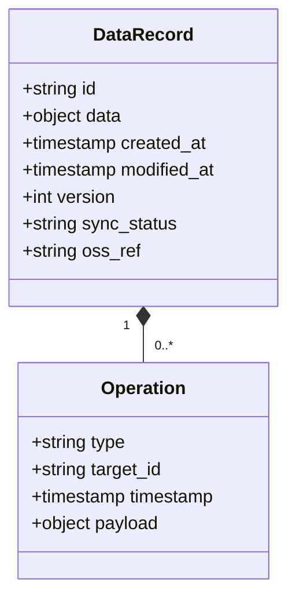

```mermaid
classDiagram
    class DataRecord {
        +string id
        +object data
        +timestamp created_at
        +timestamp modified_at
        +int version
        +string sync_status
        +string oss_ref
    }
    
    class Operation {
        +string type
        +string target_id
        +timestamp timestamp
        +object payload
    }
    
    DataRecord "1" *-- "0..*" Operation
```