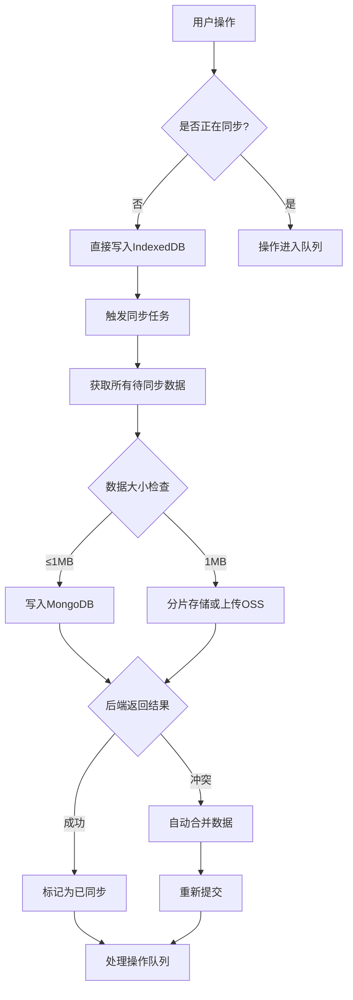

```mermaid
flowchart TD
    A[用户操作] --> B{是否正在同步?}
    B -->|否| C[直接写入IndexedDB]
    B -->|是| D[操作进入队列]
    C --> E[触发同步任务]
    E --> F[获取所有待同步数据]
    F --> G{数据大小检查}
    G -->|≤1MB| H[写入MongoDB]
    G -->|1MB| I[分片存储或上传OSS]
    H & I --> J{后端返回结果}
    J -->|成功| K[标记为已同步]
    J -->|冲突| L[自动合并数据]
    L --> M[重新提交]
    K & M --> N[处理操作队列]
```