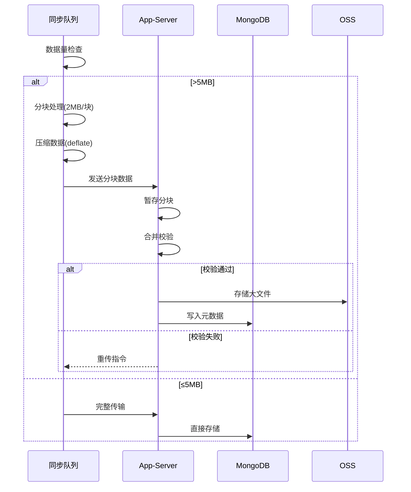

```mermaid
sequenceDiagram
    participant 同步队列
    participant App-Server
    participant MongoDB
    participant OSS

    同步队列->>同步队列: 数据量检查
    alt >5MB
        同步队列->>同步队列: 分块处理(2MB/块)
        同步队列->>同步队列: 压缩数据(deflate)
        同步队列->>App-Server: 发送分块数据
        App-Server->>App-Server: 暂存分块
        App-Server->>App-Server: 合并校验
        alt 校验通过
            App-Server->>OSS: 存储大文件
            App-Server->>MongoDB: 写入元数据
        else 校验失败
            App-Server-->>同步队列: 重传指令
        end
    else ≤5MB
        同步队列->>App-Server: 完整传输
        App-Server->>MongoDB: 直接存储
    end
```