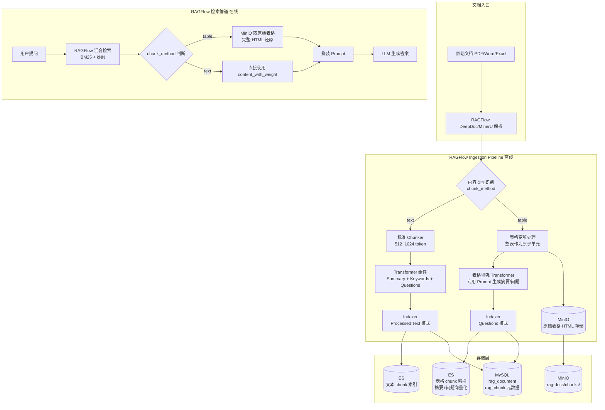

```mermaid
graph TB
    subgraph 文档入口
        A[原始文档 PDF/Word/Excel] --> B[RAGFlow DeepDoc/MinerU 解析]
    end

    subgraph RAGFlow Ingestion Pipeline 离线
        B --> C{内容类型识别\nchunk_method}
        C -->|text| D[标准 Chunker\n512~1024 token]
        C -->|table| E[表格专项处理\n整表作为原子单元]
        
        D --> F[Transformer 组件\nSummary + Keywords + Questions]
        E --> G[表格增强 Transformer\n专用 Prompt 生成摘要/问题]
        
        E --> H[(MinIO\n原始表格 HTML 存储)]
        
        F --> I[Indexer\nProcessed Text 模式]
        G --> J[Indexer\nQuestions 模式]
    end

    subgraph 存储层
        I --> K[(ES\n文本 chunk 索引)]
        J --> L[(ES\n表格 chunk 索引\n摘要+问题向量化)]
        H --> M[(MinIO\nrag-docs/chunks/)]
        I --> N[(MySQL\nrag_document\nrag_chunk 元数据)]
        J --> N
    end

    subgraph RAGFlow 检索管道 在线
        O[用户提问] --> P[RAGFlow 混合检索\nBM25 + kNN]
        P --> Q{chunk_method 判断}
        Q -->|table| R[MinIO 取原始表格\n完整 HTML 还原]
        Q -->|text| S[直接使用 content_with_weight]
        R --> T[拼装 Prompt]
        S --> T
        T --> U[LLM 生成答案]
    end

```