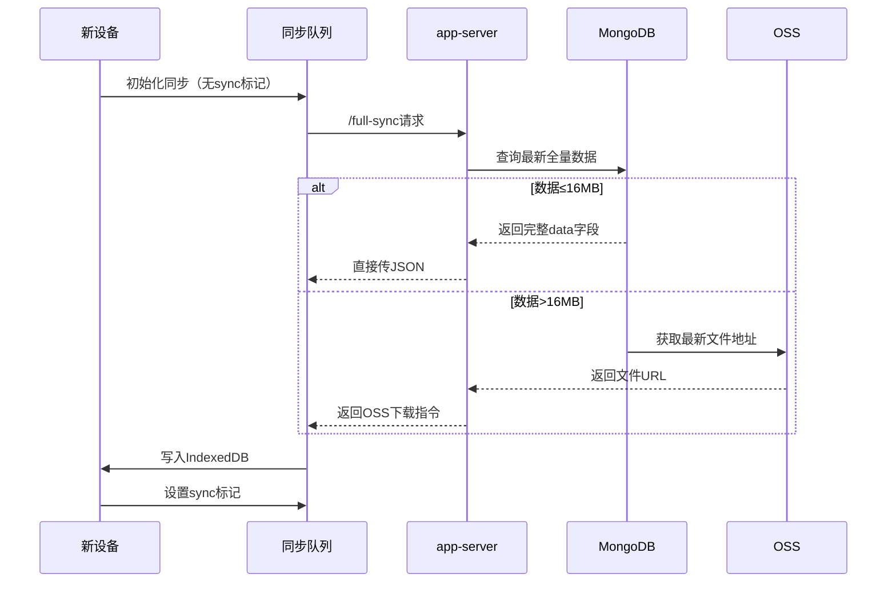

```mermaid
sequenceDiagram
    participant 新设备
    participant 同步队列
    participant app-server
    participant MongoDB
    participant OSS

    新设备->>同步队列: 初始化同步（无sync标记）
    同步队列->>app-server: /full-sync请求
    app-server->>MongoDB: 查询最新全量数据
    alt 数据≤16MB
        MongoDB-->>app-server: 返回完整data字段
        app-server-->>同步队列: 直接传JSON
    else 数据>16MB
        MongoDB->>OSS: 获取最新文件地址
        OSS-->>app-server: 返回文件URL
        app-server-->>同步队列: 返回OSS下载指令
    end
    同步队列->>新设备: 写入IndexedDB
    新设备->>同步队列: 设置sync标记
```