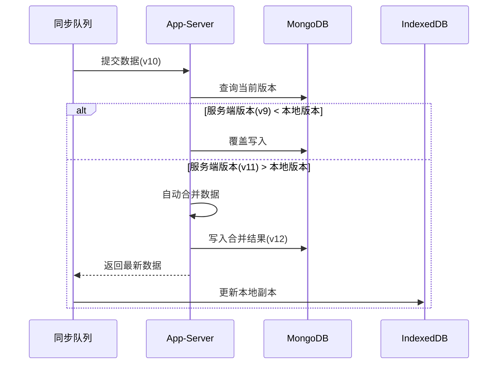

```mermaid

sequenceDiagram
    participant 同步队列
    participant App-Server
    participant MongoDB

    同步队列->>App-Server: 提交数据(v10)
    App-Server->>MongoDB: 查询当前版本
    alt 服务端版本(v9) < 本地版本
        App-Server->>MongoDB: 覆盖写入
    else 服务端版本(v11) > 本地版本
        App-Server->>App-Server: 自动合并数据
        App-Server->>MongoDB: 写入合并结果(v12)
        App-Server-->>同步队列: 返回最新数据
        同步队列->>IndexedDB: 更新本地副本
    end

```