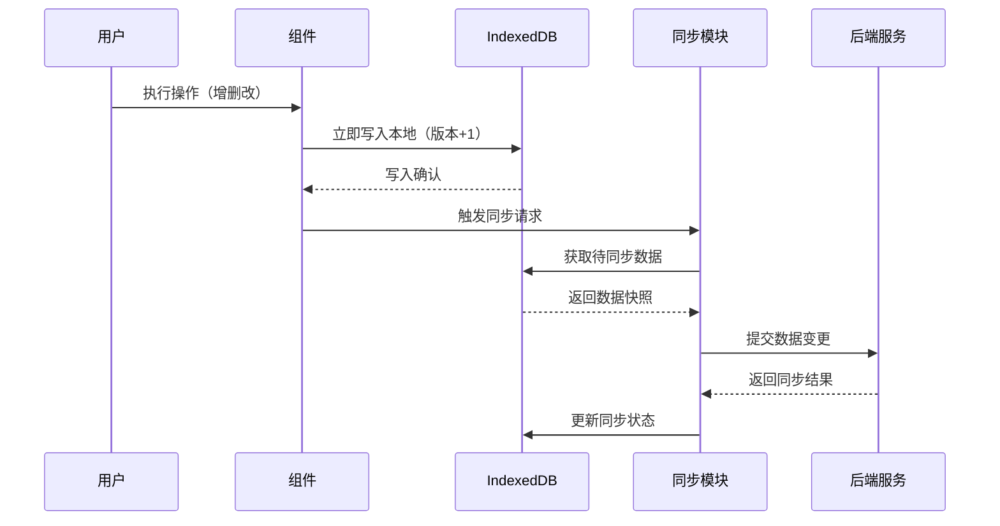

```mermaid
sequenceDiagram
    participant 用户
    participant 组件
    participant IndexedDB
    participant 同步模块
    participant 后端服务

    用户->>组件: 执行操作（增删改）
    组件->>IndexedDB: 立即写入本地（版本+1）
    IndexedDB-->>组件: 写入确认
    组件->>同步模块: 触发同步请求
    同步模块->>IndexedDB: 获取待同步数据
    IndexedDB-->>同步模块: 返回数据快照
    同步模块->>后端服务: 提交数据变更
    后端服务-->>同步模块: 返回同步结果
    同步模块->>IndexedDB: 更新同步状态
```