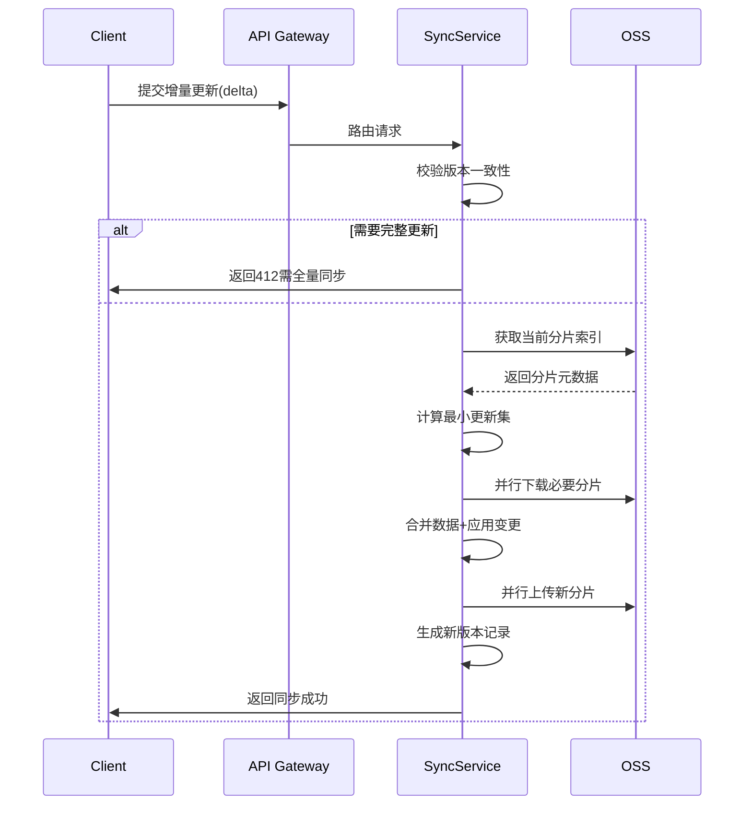

```mermaid
sequenceDiagram
    participant Client
    participant API Gateway
    participant SyncService
    participant OSS
    
    Client->>API Gateway: 提交增量更新(delta)
    API Gateway->>SyncService: 路由请求
    SyncService->>SyncService: 校验版本一致性
    alt 需要完整更新
        SyncService->>Client: 返回412需全量同步
    else
        SyncService->>OSS: 获取当前分片索引
        OSS-->>SyncService: 返回分片元数据
        SyncService->>SyncService: 计算最小更新集
        SyncService->>OSS: 并行下载必要分片
        SyncService->>SyncService: 合并数据+应用变更
        SyncService->>OSS: 并行上传新分片
        SyncService->>SyncService: 生成新版本记录
        SyncService->>Client: 返回同步成功
    end
```