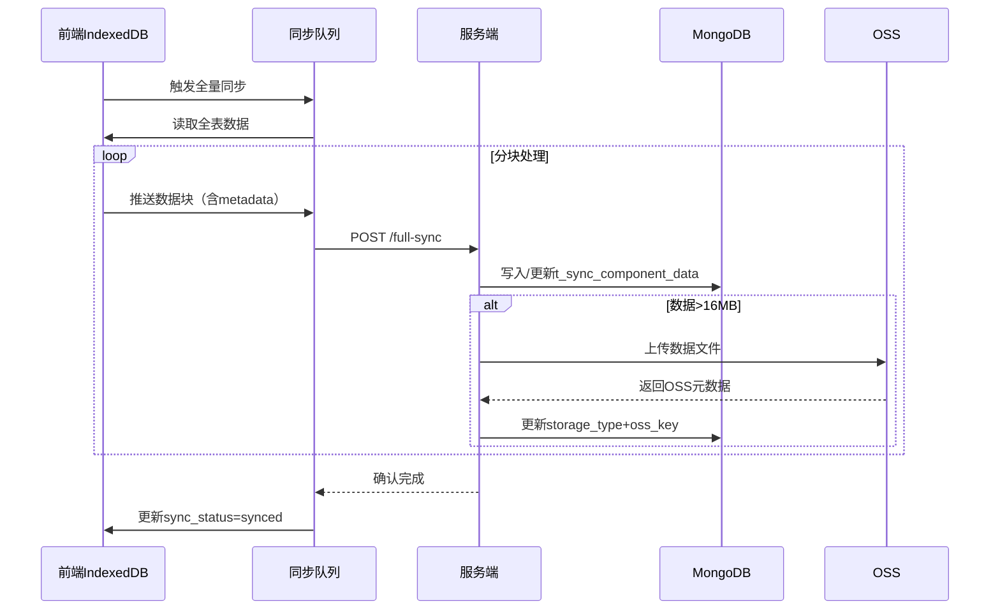

```mermaid
sequenceDiagram
    participant 前端 as 前端IndexedDB
    participant 同步队列
    participant 服务端
    participant MongoDB
    participant OSS

    前端->>同步队列: 触发全量同步
    同步队列->>前端: 读取全表数据
    loop 分块处理
        前端->>同步队列: 推送数据块（含metadata）
        同步队列->>服务端: POST /full-sync
        服务端->>MongoDB: 写入/更新t_sync_component_data
        alt 数据>16MB
            服务端->>OSS: 上传数据文件
            OSS-->>服务端: 返回OSS元数据
            服务端->>MongoDB: 更新storage_type+oss_key
        end
    end
    服务端-->>同步队列: 确认完成
    同步队列->>前端: 更新sync_status=synced
```