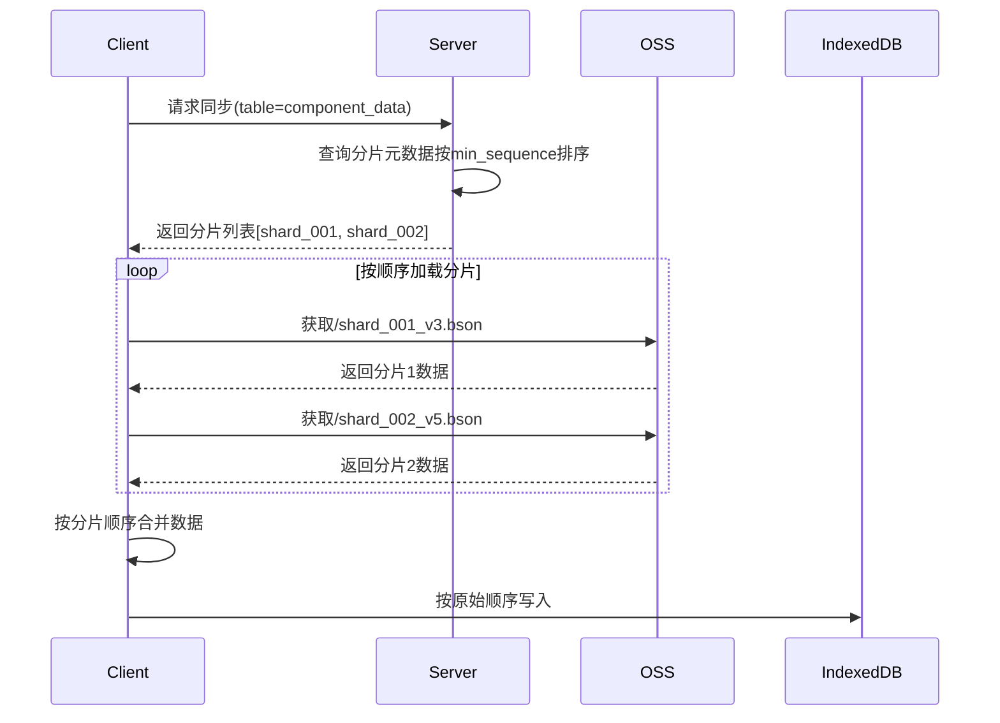

```mermaid
sequenceDiagram
    participant Client
    participant Server
    participant OSS

    Client->>Server: 请求同步(table=component_data)
    Server->>Server: 查询分片元数据按min_sequence排序
    Server-->>Client: 返回分片列表[shard_001, shard_002]
    
    loop 按顺序加载分片
        Client->>OSS: 获取/shard_001_v3.bson
        OSS-->>Client: 返回分片1数据
        Client->>OSS: 获取/shard_002_v5.bson
        OSS-->>Client: 返回分片2数据
    end

    Client->>Client: 按分片顺序合并数据
    Client->>IndexedDB: 按原始顺序写入
```