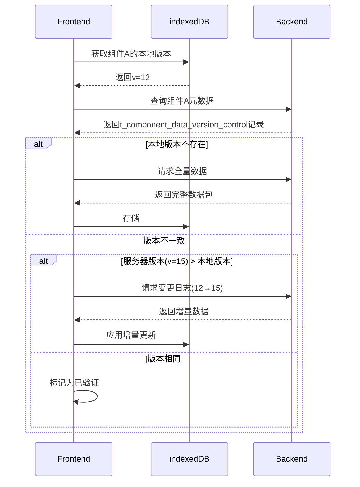

```mermaid
sequenceDiagram
    participant Frontend
    participant indexedDB
    participant Backend

    Frontend->>indexedDB: 获取组件A的本地版本
    indexedDB-->>Frontend: 返回v=12
    
    Frontend->>Backend: 查询组件A元数据
    Backend-->>Frontend: 返回t_component_data_version_control记录
    
    alt 本地版本不存在
        Frontend->>Backend: 请求全量数据
        Backend-->>Frontend: 返回完整数据包
        Frontend->>indexedDB: 存储
    else 版本不一致
        alt 服务器版本(v=15) > 本地版本
            Frontend->>Backend: 请求变更日志(12→15)
            Backend-->>Frontend: 返回增量数据
            Frontend->>indexedDB: 应用增量更新
        else 版本相同
            Frontend->>Frontend: 标记为已验证
        end
    end
```