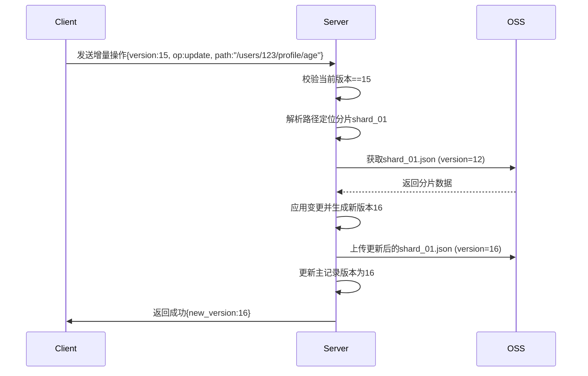

```mermaid
sequenceDiagram
    participant Client
    participant Server
    participant OSS
    
    Client->>Server: 发送增量操作{version:15, op:update, path:"/users/123/profile/age"}
    Server->>Server: 校验当前版本==15
    Server->>Server: 解析路径定位分片shard_01
    Server->>OSS: 获取shard_01.json (version=12)
    OSS-->>Server: 返回分片数据
    Server->>Server: 应用变更并生成新版本16
    Server->>OSS: 上传更新后的shard_01.json (version=16)
    Server->>Server: 更新主记录版本为16
    Server->>Client: 返回成功{new_version:16}
```