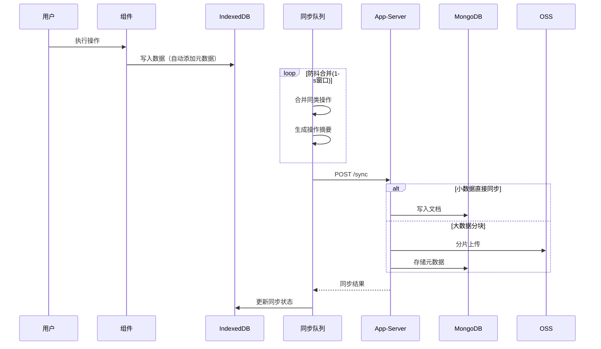

```mermaid
sequenceDiagram
    participant 用户
    participant 组件
    participant IndexedDB
    participant 同步队列
    participant App-Server
    participant MongoDB
    participant OSS

    用户->>组件: 执行操作
    组件->>IndexedDB: 写入数据（自动添加元数据）
    
    loop 防抖合并(1s窗口)
        同步队列->>同步队列: 合并同类操作
        同步队列->>同步队列: 生成操作摘要
    end
    
    同步队列->>App-Server: POST /sync
    alt 小数据直接同步
        App-Server->>MongoDB: 写入文档
    else 大数据分块
        App-Server->>OSS: 分片上传
        App-Server->>MongoDB: 存储元数据
    end
    
    App-Server-->>同步队列: 同步结果
    同步队列->>IndexedDB: 更新同步状态
```