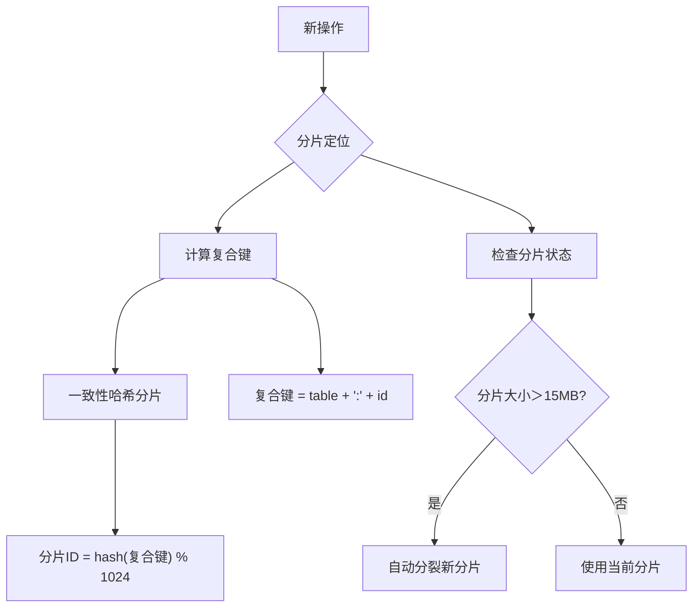

```mermaid
graph TD
    A[新操作] --> B{分片定位}
    B --> C[计算复合键]
    C --> D[一致性哈希分片]
    
    C --> E["复合键 = table + ':' + id"]
    D --> F["分片ID = hash(复合键) % 1024"]
    
    B --> G[检查分片状态]
    G --> H{分片大小＞15MB?}
    H -- 是 --> I[自动分裂新分片]
    H -- 否 --> J[使用当前分片]
```