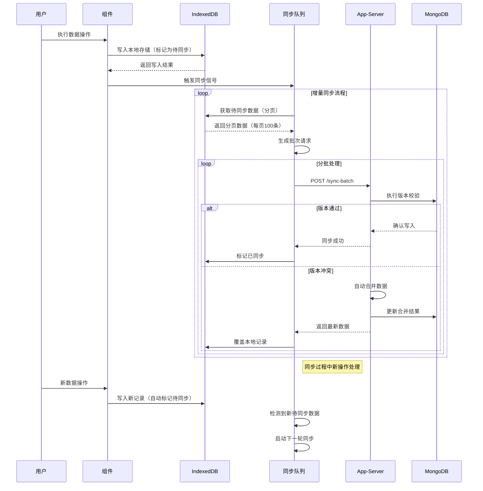

```mermaid
sequenceDiagram
    participant 用户
    participant 组件
    participant IndexedDB
    participant 同步队列
    participant App-Server
    participant MongoDB

    用户->>组件: 执行数据操作
    组件->>IndexedDB: 写入本地存储（标记为待同步）
    IndexedDB-->>组件: 返回写入结果
    组件->>同步队列: 触发同步信号

    loop 增量同步流程
        同步队列->>IndexedDB: 获取待同步数据（分页）
        IndexedDB-->>同步队列: 返回分页数据（每页100条）
        
        同步队列->>同步队列: 生成批次请求
        loop 分批处理
            同步队列->>App-Server: POST /sync-batch
            App-Server->>MongoDB: 执行版本校验
            alt 版本通过
                MongoDB-->>App-Server: 确认写入
                App-Server-->>同步队列: 同步成功
                同步队列->>IndexedDB: 标记已同步
            else 版本冲突
                App-Server->>App-Server: 自动合并数据
                App-Server->>MongoDB: 更新合并结果
                App-Server-->>同步队列: 返回最新数据
                同步队列->>IndexedDB: 覆盖本地记录
            end
        end
    end

    Note right of 同步队列: 同步过程中新操作处理
    用户->>组件: 新数据操作
    组件->>IndexedDB: 写入新记录（自动标记待同步）
    同步队列->>同步队列: 检测到新待同步数据
    同步队列->>同步队列: 启动下一轮同步
```