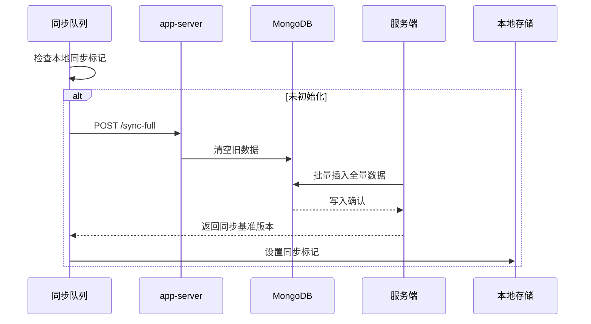

```mermaid
sequenceDiagram
    participant 同步队列
    participant app-server
    participant MongoDB

    同步队列->>同步队列: 检查本地同步标记
    alt 未初始化
        同步队列->>app-server: POST /sync-full
        app-server->>MongoDB: 清空旧数据
        服务端->>MongoDB: 批量插入全量数据
        MongoDB-->>服务端: 写入确认
        服务端-->>同步队列: 返回同步基准版本
        同步队列->>本地存储: 设置同步标记
    end
```