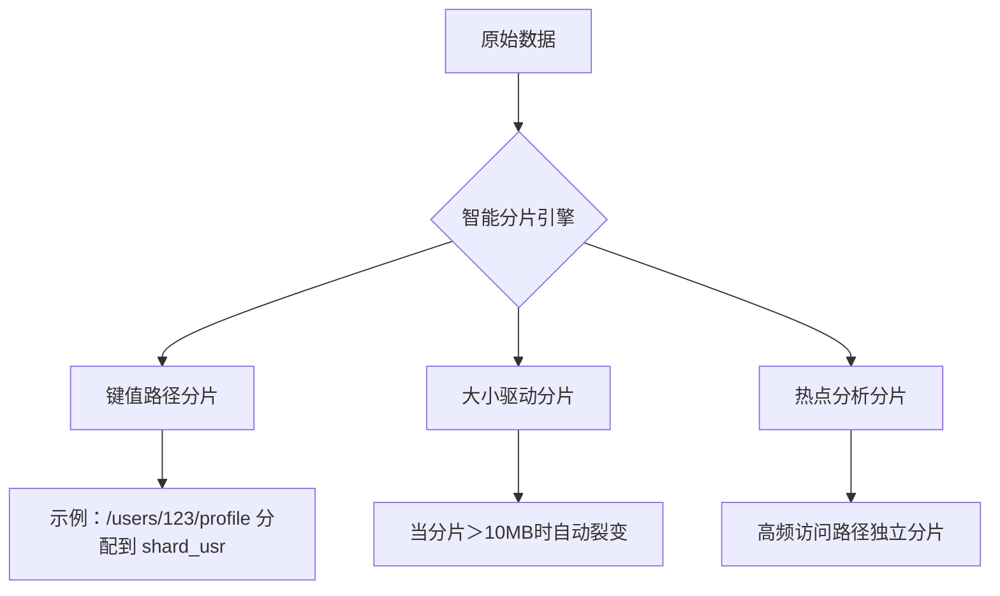

```mermaid
graph TD
    A[原始数据] --> B{智能分片引擎}
    B --> C[键值路径分片]
    B --> D[大小驱动分片]
    B --> E[热点分析分片]
    
    C --> F["示例：/users/123/profile 分配到 shard_usr"]
    D --> G["当分片＞10MB时自动裂变"]
    E --> H["高频访问路径独立分片"]
```