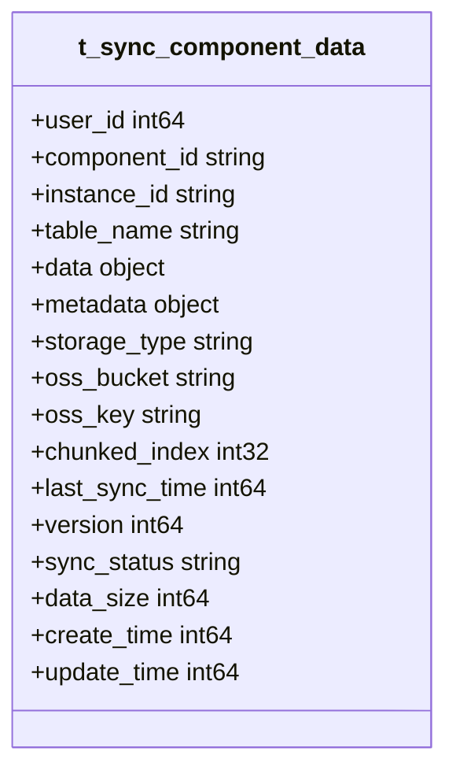

```mermaid
classDiagram
    class t_sync_component_data {
        +user_id int64
        +component_id string
        +instance_id string
        +table_name string
        +data object
        +metadata object
        +storage_type string
        +oss_bucket string
        +oss_key string
        +chunked_index int32
        +last_sync_time int64
        +version int64
        +sync_status string
        +data_size int64
        +create_time int64
        +update_time int64
    }
```