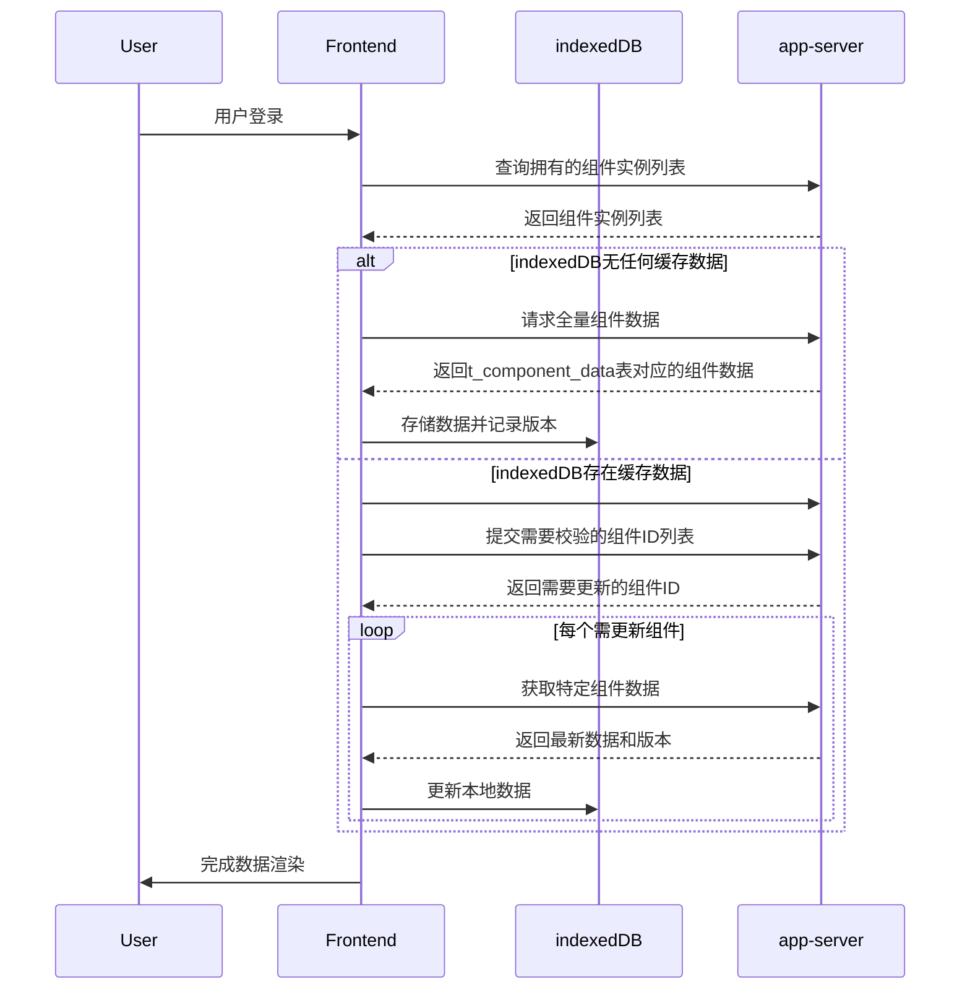

```mermaid
sequenceDiagram
    participant User
    participant Frontend
    participant indexedDB
    participant app-server

    User->>Frontend: 用户登录
    Frontend->>app-server: 查询拥有的组件实例列表
    app-server-->>Frontend: 返回组件实例列表
    
    alt indexedDB无任何缓存数据
        Frontend->>app-server: 请求全量组件数据
        app-server-->>Frontend: 返回t_component_data表对应的组件数据
        Frontend->>indexedDB: 存储数据并记录版本
    else indexedDB存在缓存数据
        Frontend->>app-server: 
        Frontend->>app-server: 提交需要校验的组件ID列表
        app-server-->>Frontend: 返回需要更新的组件ID
        loop 每个需更新组件
            Frontend->>app-server: 获取特定组件数据
            app-server-->>Frontend: 返回最新数据和版本
            Frontend->>indexedDB: 更新本地数据
        end
    end
    Frontend->>User: 完成数据渲染
```