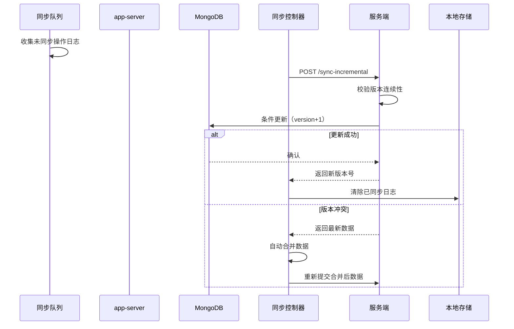

```mermaid
sequenceDiagram
    participant 同步队列
    participant app-server
    participant MongoDB

    同步队列->>同步队列: 收集未同步操作日志
    同步控制器->>服务端: POST /sync-incremental
    服务端->>服务端: 校验版本连续性
    服务端->>MongoDB: 条件更新（version+1）
    alt 更新成功
        MongoDB-->>服务端: 确认
        服务端-->>同步控制器: 返回新版本号
        同步控制器->>本地存储: 清除已同步日志
    else 版本冲突
        服务端-->>同步控制器: 返回最新数据
        同步控制器->>同步控制器: 自动合并数据
        同步控制器->>服务端: 重新提交合并后数据
    end
```