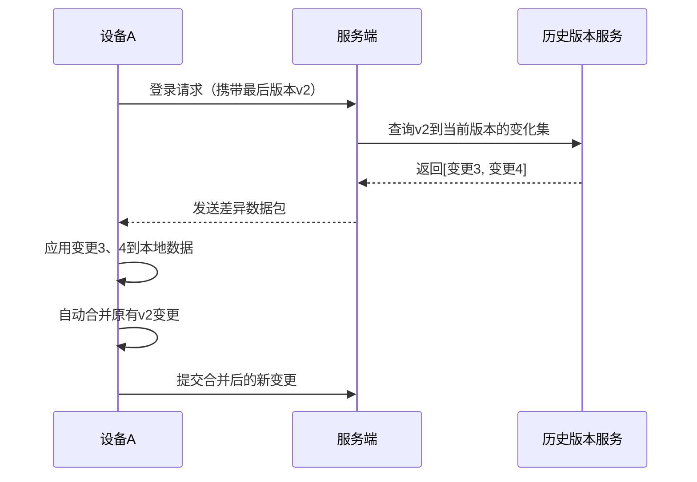

```mermaid
sequenceDiagram
    participant A as 设备A
    participant S as 服务端
    participant H as 历史版本服务

    A->>S: 登录请求（携带最后版本v2）
    S->>H: 查询v2到当前版本的变化集
    H-->>S: 返回[变更3, 变更4]
    S-->>A: 发送差异数据包
    A->>A: 应用变更3、4到本地数据
    A->>A: 自动合并原有v2变更
    A->>S: 提交合并后的新变更
```