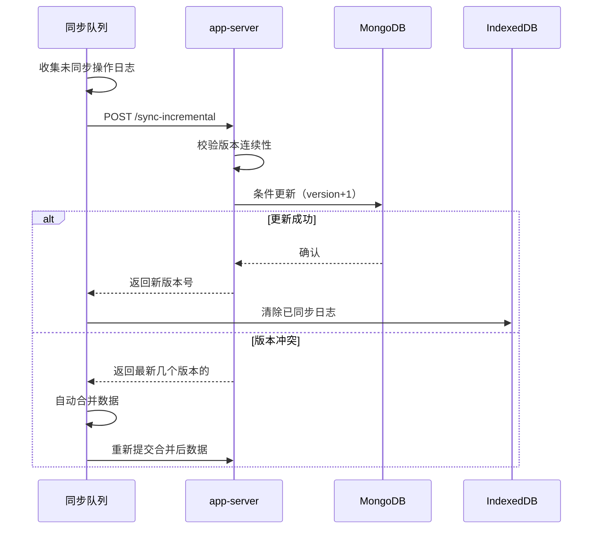

```mermaid

sequenceDiagram
    participant 同步队列
    participant app-server
    participant MongoDB


    同步队列->>同步队列: 收集未同步操作日志
    同步队列->>app-server: POST /sync-incremental
    app-server->>app-server: 校验版本连续性
    app-server->>MongoDB: 条件更新（version+1）
    alt 更新成功
        MongoDB-->>app-server: 确认
        app-server-->>同步队列: 返回新版本号
        同步队列->>IndexedDB: 清除已同步日志
    else 版本冲突
        app-server-->>同步队列: 返回最新几个版本的
        同步队列->>同步队列: 自动合并数据
        同步队列->>app-server: 重新提交合并后数据
    end

```