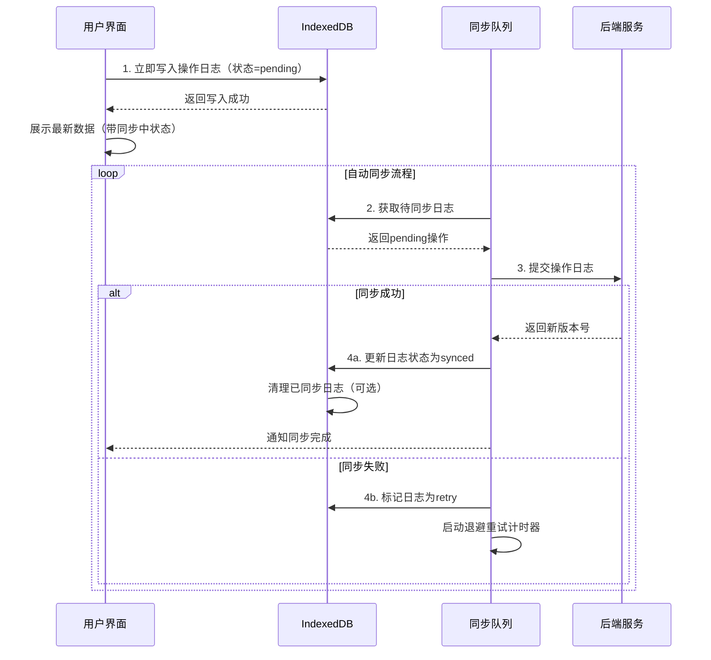

```mermaid
sequenceDiagram
    participant UI as 用户界面
    participant Local as IndexedDB
    participant Sync as 同步队列
    participant Server as 后端服务

    UI->>Local: 1. 立即写入操作日志（状态=pending）
    Local-->>UI: 返回写入成功
    UI->>UI: 展示最新数据（带同步中状态）

    loop 自动同步流程
        Sync->>Local: 2. 获取待同步日志
        Local-->>Sync: 返回pending操作
        Sync->>Server: 3. 提交操作日志
        alt 同步成功
            Server-->>Sync: 返回新版本号
            Sync->>Local: 4a. 更新日志状态为synced
            Local->>Local: 清理已同步日志（可选）
            Sync-->>UI: 通知同步完成
        else 同步失败
            Sync->>Local: 4b. 标记日志为retry
            Sync->>Sync: 启动退避重试计时器
        end
    end
```