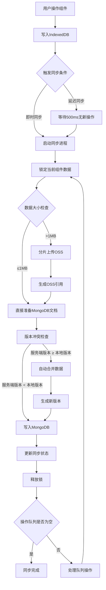

```mermaid
flowchart TD
    A[用户操作组件] --> B[写入IndexedDB]
    B --> C{触发同步条件}
    C -->|即时同步| D[启动同步进程]
    C -->|延迟同步| E[等待500ms无新操作]
    E --> D
    
    D --> F[锁定当前组件数据]
    F --> G{数据大小检查}
    G -->|≤1MB| H[直接准备MongoDB文档]
    G -->|>1MB| I[分片上传OSS]
    I --> J[生成OSS引用]
    J --> H
    
    H --> K[版本冲突检查]
    K -->|服务端版本 < 本地版本| L[写入MongoDB]
    K -->|服务端版本 ≥ 本地版本| M[自动合并数据]
    M --> N[生成新版本]
    N --> L
    
    L --> O[更新同步状态]
    O --> P[释放锁]
    P --> Q{操作队列是否为空}
    Q -->|是| R[同步完成]
    Q -->|否| S[处理队列操作]
    S --> F
```