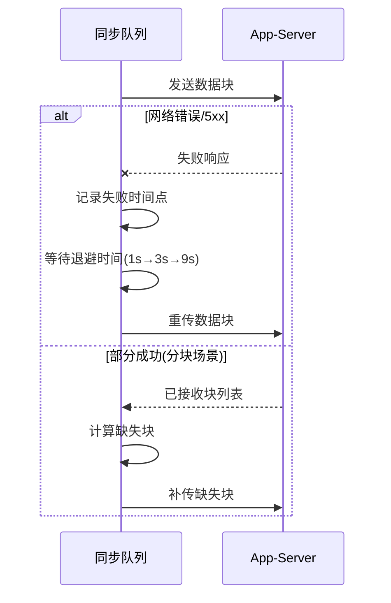

```mermaid
sequenceDiagram
    participant 同步队列
    participant App-Server

    同步队列->>App-Server: 发送数据块
    alt 网络错误/5xx
        App-Server--x 同步队列: 失败响应
        同步队列->>同步队列: 记录失败时间点
        同步队列->>同步队列: 等待退避时间(1s→3s→9s)
        同步队列->>App-Server: 重传数据块
    else 部分成功(分块场景)
        App-Server-->>同步队列: 已接收块列表
        同步队列->>同步队列: 计算缺失块
        同步队列->>App-Server: 补传缺失块
    end
```