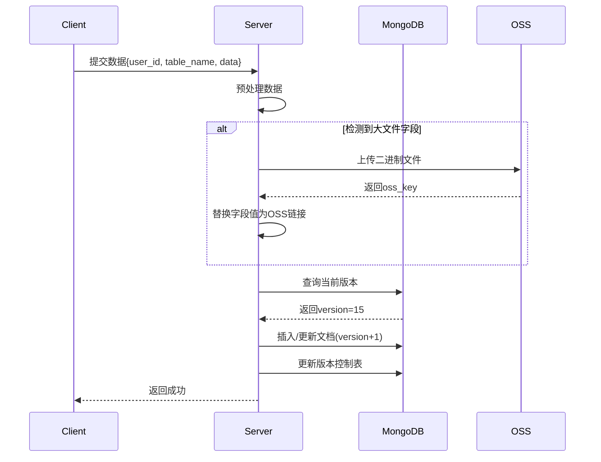

```mermaid
sequenceDiagram
    participant Client
    participant Server
    participant MongoDB
    participant OSS

    Client->>Server: 提交数据{user_id, table_name, data}
    Server->>Server: 预处理数据
    alt 检测到大文件字段
        Server->>OSS: 上传二进制文件
        OSS-->>Server: 返回oss_key
        Server->>Server: 替换字段值为OSS链接
    end
    Server->>MongoDB: 查询当前版本
    MongoDB-->>Server: 返回version=15
    Server->>MongoDB: 插入/更新文档(version+1)
    Server->>MongoDB: 更新版本控制表
    Server-->>Client: 返回成功
```