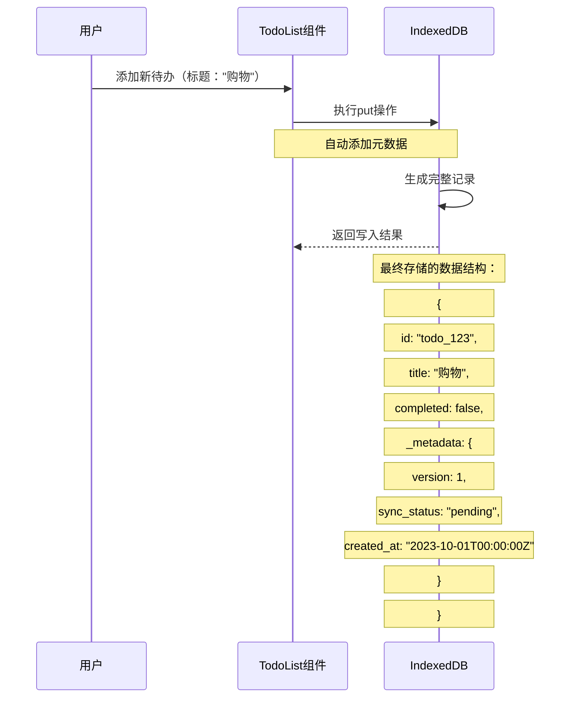

```mermaid
sequenceDiagram
    participant 用户
    participant TodoList组件
    participant IndexedDB

    用户->>TodoList组件: 添加新待办（标题："购物"）
    TodoList组件->>IndexedDB: 执行put操作
    Note over TodoList组件,IndexedDB: 自动添加元数据
    IndexedDB->>IndexedDB: 生成完整记录
    IndexedDB-->>TodoList组件: 返回写入结果

    Note over IndexedDB: 最终存储的数据结构：
    Note over IndexedDB: {
    Note over IndexedDB:   id: "todo_123",
    Note over IndexedDB:   title: "购物",
    Note over IndexedDB:   completed: false,
    Note over IndexedDB:   _metadata: {
    Note over IndexedDB:     version: 1,
    Note over IndexedDB:     sync_status: "pending",
    Note over IndexedDB:     created_at: "2023-10-01T00:00:00Z"
    Note over IndexedDB:   }
    Note over IndexedDB: }
```