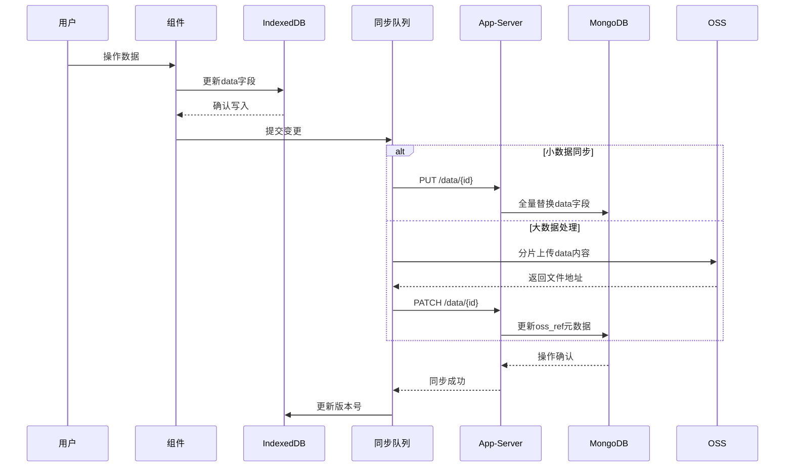

```mermaid
sequenceDiagram
    participant 用户
    participant 组件
    participant IndexedDB
    participant 同步队列
    participant App-Server
    participant MongoDB
    participant OSS

    用户->>组件: 操作数据
    组件->>IndexedDB: 更新data字段
    IndexedDB-->>组件: 确认写入
    组件->>同步队列: 提交变更
    
    alt 小数据同步
        同步队列->>App-Server: PUT /data/{id}
        App-Server->>MongoDB: 全量替换data字段
    else 大数据处理
        同步队列->>OSS: 分片上传data内容
        OSS-->>同步队列: 返回文件地址
        同步队列->>App-Server: PATCH /data/{id}
        App-Server->>MongoDB: 更新oss_ref元数据
    end
    
    MongoDB-->>App-Server: 操作确认
    App-Server-->>同步队列: 同步成功
    同步队列->>IndexedDB: 更新版本号
```